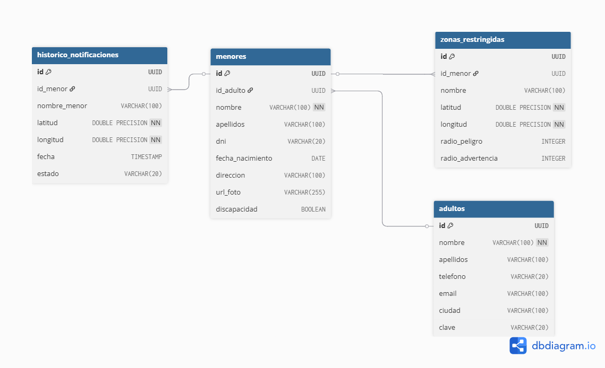

# SaveChild Guardian - Real-Time Child Monitoring System 📍

## Descripción del Proyecto

Este proyecto implementa una solución de streaming de datos para la seguridad infantil. Utiliza sensores de ubicación (simulados) para detectar si un menor entra en zonas restringidas, notificando a los padres y guardando un histórico en la nube. Los datos se transmiten en tiempo real, y se almacenan en una base de datos NoSQL para análisis posterior. 

El sistema también incluye una app para que los padres puedan monitorear la ubicación de sus hijos y recibir alertas instantáneas. De esta manera, se busca proporcionar una herramienta efectiva para la protección de los menores, permitiendo a los padres estar tranquilos sabiendo que pueden actuar rápidamente en caso de cualquier situación de riesgo. Otras características que incluye es la capacidad de configurar zonas seguras y restringidas, así como la integración con servicios de mensajería para enviar alertas a los padres. Este proyecto es una demostración de cómo la tecnología puede ser utilizada para mejorar la seguridad y el bienestar de los niños en un mundo cada vez más conectado.

Por otra parte, se almacenan los datos en la nube utilizando una base de datos NoSQL, lo que permite una gestión eficiente de grandes volúmenes de información y una rápida recuperación de datos. Esto es crucial para el sistema, ya que se generan múltiples eventos y alertas en tiempo real. Estos resumenes de los eventos ocurridos se muestran en un dashboard para que los padres puedan revisar el historial de ubicaciones y alertas de sus hijos.

El almacenamiento de datos en la nube permite un acceso fácil y seguro a la información, garantizando que los padres puedan revisar el historial de ubicaciones y alertas en cualquier momento. Además, el sistema está diseñado para ser escalable, permitiendo la incorporación de más sensores o funcionalidades en el futuro sin comprometer el rendimiento. 

## Arquitectura


## Modelo de Datos Relacional (PostgreSQL)

La persistencia de la configuración y el estado maestro del sistema se gestiona en **Cloud SQL**. Se ha diseñado un esquema relacional que garantiza la integridad de los datos y facilita el enriquecimiento de los mensajes en el pipeline.



### 1. Gestión de Usuarios (Tabla `adultos`)

Representa a los tutores legales en el sistema. Es la entidad raíz para la gestión de permisos en la aplicación.

* **Campos clave**: `id` (PK), `telefono` (usado para login), `email` y `nombre`.
  
### 2. Entidad Menores (Tabla `menores`)

Contiene los perfiles de los niños protegidos. 

* **Relación**: Posee una clave foránea (`id_adulto`) que vincula a cada menor con su tutor responsable.
* **Multimedia**: Almacena la `url_foto` que referencia a los archivos en **GCS**.

### 3. Zonas Restringidas (Tabla `zonas_restringidas`)

Define los parámetros espaciales para el motor de reglas de Dataflow.

* **Atributos**: `latitud`, `longitud`, `radio_peligro` (m) y `radio_advertencia` (m).
* **Uso**: El pipeline realiza un JOIN dinámico con esta tabla para evaluar la seguridad de cada coordenada recibida.

### 4. Histórico de Notificaciones (Tabla `historico_notificaciones`)

Almacena el resultado de cada procesamiento crítico realizado por el pipeline.

* **Campos**: `id_menor`, `nombre_menor`, `estado` y `fecha`.
* **Propósito**: Alimentar la vista de "Alertas" de la aplicación web de forma rápida.
  
## Tecnologías utilizadas

* **Google Cloud Platform (GCP)**: Hosting de toda la infraestructura.
  
* **Apache Beam & Dataflow**: Procesamiento de datos en streaming.
  
* **Pub/Sub**: Ingesta de mensajes de ubicación.
  
* **Cloud SQL (PostgreSQL)**: Gestión de zonas y usuarios.
  
* **BigQuery**: Data Warehouse para análisis histórico.
  
* **Firestore**: Base de datos NoSQL para alertas en tiempo real.
  
* **Terraform**: Infraestructura como código.

## Prerrequisitos

* Python 3.9 o superior.
  
* Google Cloud SDK instalado y configurado.
  
* Una cuenta de servicio en GCP con permisos de Editor.
  
* Docker Desktop (para ejecución de contenedores locales).

## Despliegue de la Infraestructura

Este proyecto utiliza **Terraform** para gestionar la infraestructura como código (IaC), permitiendo que todo el entorno de Google Cloud se despliegue de forma automática y consistente.

### Pasos para el despliegue inicial:

1. **Inicializar el entorno**: Prepara los proveedores y el backend.
   ```bash
   terraform init
   ```

2. **Planificar el despliegue**: Revisa los cambios que se aplicarán a la infraestructura.
   ```bash
   terraform plan
   ```

3. **Ejecutar el despliegue**: Aplica los cambios para crear los recursos en Google Cloud.
   ```bash
   terraform apply
   ```

## Procesamiento de Datos (Dataflow Pipeline)

El pipeline de procesamiento está desarrollado en **Apache Beam** y se ejecuta de forma escalable en **Google Cloud Dataflow**. Su función principal es el enriquecimiento de datos en tiempo real.

### Lógica de Procesamiento:

1. **Consumo**: Lee eventos de ubicación desde Pub/Sub.

2. **Enriquecimiento**: Realiza una consulta a Cloud SQL para obtener la información de las zonas restringidas asociadas al menor.
   
3. **Cálculo Geoespacial**: Utiliza la librería `geopy` para calcular la distancia entre la posición actual y los radios de peligro.
   
4. **Ramificación**: Los datos se envían simultáneamente a BigQuery (histórico), Firestore (alertas activas) y Postgres (para reportes de seguridad).

## Clasificación de Estados

El motor de reglas evalúa la distancia geodésica y clasifica el evento según la configuración de la base de datos:

| Estado | Acción del Sistema |
| :--- | :--- |
| **OK** | Registro silencioso en BigQuery. |
| **ADVERTENCIA** | Notificación preventiva en la App. |
| **PELIGRO** | Alerta crítica y guardado en histórico de seguridad. |

## Interfaz de Monitoreo (Streamlit App)

La plataforma incluye una aplicación web desarrollada con **Streamlit**, diseñada para que los padres y tutores puedan interactuar con el sistema de seguridad de forma intuitiva. 

La aplicación se conecta directamente a **Cloud SQL** mediante el conector de Google Cloud y recupera archivos multimedia desde **Google Cloud Storage**.

### Control de Acceso y Registro

La seguridad de la App incluye:

* **Sistema de Login/Registro**: Validación de credenciales contra la tabla de `adultos` en PostgreSQL.
* **Sesiones Seguras**: Uso de `st.session_state` para mantener la persistencia del usuario y limitar los intentos de acceso fallidos (máximo 3 intentos).
* **Gestión de Perfiles**: Los padres pueden registrarse y acceder únicamente a la información de los menores vinculados a su ID de usuario.

### Gestión de Menores y Multimedia

Una vez iniciada la sesión, la app permite:

* **Exploración de Perfiles**: Visualización de tarjetas personalizadas para cada hijo.
* **Integración con GCS**: Las fotografías de los menores se recuperan dinámicamente desde un **Bucket de Google Cloud Storage** mediante el cliente oficial de Python.
* **Fichas de Datos**: Visualización de información sensible (DNI, fecha de nacimiento, dirección, discapacidad) recuperada de forma segura desde Cloud SQL.

### Visualización Geoespacial (Mapas)

El corazón de la aplicación es su mapa interactivo, construido con la librería **Folium**:

* **Capas Personalizables**: El usuario puede alternar entre vista de Callejero (OpenStreetMap), Satélite (Esri World Imagery) y Modo Oscuro (CartoDB).
* **Representación de Zonas**: Las zonas restringidas se dibujan dinámicamente sobre el mapa:
    * 🟡 **Círculos Amarillos**: Radios de advertencia.
    * 🔴 **Círculos Rojos**: Radios de peligro inminente.
* **Centrado Inteligente**: El mapa se geolocaliza automáticamente en la ciudad de residencia del menor.

### Configuración Técnica de la App

La aplicación utiliza variables de entorno para una configuración segura y flexible:

* `PROYECTO_REGION_INSTANCIA`: Conexión al socket de Cloud SQL.
* `USUARIO_DB` / `CONTR_DB`: Credenciales de acceso a PostgreSQL.
* `BUCKET_FOTOS`: Nombre del bucket de GCS para los activos multimedia.
* **IP Privada**: El conector utiliza `IPTypes.PRIVATE` para garantizar que el tráfico de datos no salga a la internet pública.


